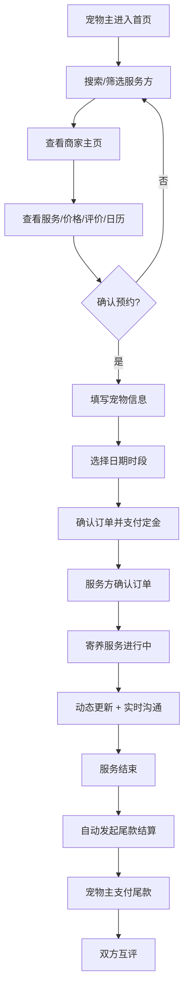

# 宠物寄养预约管理平台 PRD

## 1. 产品概述

宠物寄养预约管理平台是连接寄养服务方与宠物主的O2O服务平台，解决宠物主出行期间宠物照护难题，为服务方提供标准化的订单管理和经营工具。

- 核心用户：寄养服务方（个人/机构）、宠物主（养宠人群）、平台运营方
- 核心价值：降低宠物寄养信任成本，提升服务交易效率，保障服务质量和宠物安全

---

## 2. 核心功能

### 2.1 用户角色

| 角色 | 注册方式 | 核心权限 |
|------|----------|----------|
| 寄养服务方 | 手机号+资质审核 | 创建商家主页、设置服务、管理预约、发送动态、查看收入 |
| 宠物主 | 手机号/第三方登录 | 搜索商家、预约服务、支付、消息沟通、发布评价 |
| 平台管理员 | 后台账号 | 审核商家、处理投诉、管理风控、超差评人工审核触发 |

### 2.2 功能模块

1. **首页/搜索页**：推荐商家、附近搜索、筛选条件、分类导航
2. **商家主页**：环境照片、服务项目、价格、评价、空位日历、预约入口
3. **服务方后台**：预约日历、待接宠物信息、订单管理、收入统计、商家设置
4. **预约下单**：宠物信息填写、日期时段选择、定金支付
5. **寄养服务中**：图片动态更新、实时消息沟通
6. **订单完结**：尾款结算、双方互评
7. **平台审核**：超差评商家触发人工审核流程

### 2.3 页面详情

| 页面名称 | 模块名称 | 功能描述 |
|----------|----------|----------|
| 首页 | Hero区 + 搜索栏 | 搜索附近服务方、按服务类型筛选、推荐位展示 |
| 首页 | 服务分类导航 | 日间照料/上门喂养/住宿寄养三大类快捷入口 |
| 首页 | 优质商家推荐 | 卡片式推荐高评分服务方，展示核心指标 |
| 搜索结果页 | 筛选条件栏 | 距离、价格区间、宠物类型、服务类型、日期筛选 |
| 搜索结果页 | 商家列表 | 卡片式列表展示评分、价格、距离、服务类型 |
| 商家主页 | 商家信息头部 | 名称、评分、地址、营业时间、联系按钮 |
| 商家主页 | 环境照片画廊 | 多图轮播+网格展示寄养环境照片 |
| 商家主页 | 服务项目与价格 | 三类服务卡片展示价格、描述、可预约状态 |
| 商家主页 | 宠物配置信息 | 可接受的宠物类型、数量上限、品种限制说明 |
| 商家主页 | 空位日历 | 月度日历展示每日可预约/已满状态 |
| 商家主页 | 用户评价 | 真实评价列表、星级分布、好评/中/差评筛选 |
| 预约下单页 | 宠物信息表单 | 品种、年龄、疫苗记录上传、特殊注意事项 |
| 预约下单页 | 日期时段选择 | 日历+时段选择器，联动显示可用空位 |
| 预约下单页 | 价格明细与支付 | 费用明细、定金金额、在线支付入口 |
| 服务方后台 | 预约日历看板 | 周/月视图、不同状态订单颜色区分 |
| 服务方后台 | 待接宠物列表 | 宠物信息卡片、疫苗状态、预约详情 |
| 服务方后台 | 动态发布 | 上传宠物照片/小视频、选择关联订单发送 |
| 服务方后台 | 收入统计 | 月收入趋势图、订单数量统计、服务费明细 |
| 服务进行中 | 动态时间线 | 按时间倒序展示服务方发布的宠物动态 |
| 服务进行中 | 实时消息 | 宠物主与服务方一对一聊天窗口 |
| 订单详情页 | 订单状态追踪 | 待确认/进行中/待结算/已完成各状态时间轴 |
| 订单详情页 | 尾款结算 | 自动计算尾款金额、支付入口 |
| 评价页面 | 互评表单 | 星级评分+文字评价+图片上传，双方独立评价 |
| 平台审核后台 | 风控列表 | 超差评商家列表、投诉记录、审核操作按钮 |

---

## 3. 核心流程

### 3.1 宠物主预约流程

宠物主打开首页 → 搜索或选择服务类型 → 查看搜索结果筛选 → 进入商家主页查看详情 → 查看空位日历和评价 → 点击"立即预约" → 填写宠物信息（品种/年龄/疫苗/注意事项） → 选择服务日期和时段 → 查看价格明细 → 在线支付定金 → 预约成功 → 等待服务方确认 → 寄养期间查看动态更新/消息沟通 → 服务结束 → 支付尾款 → 评价服务方。

### 3.2 服务方经营流程

服务方注册 → 完善商家主页信息 → 上传环境照片 → 设置服务项目与价格 → 配置可接受宠物类型和数量 → 平台审核通过 → 发布上线 → 接收预约请求 → 确认/拒绝订单 → 查看待接宠物信息 → 寄养期间定时发送动态 → 实时回复消息 → 服务完成 → 查看尾款结算 → 查看收入统计 → 管理评价。

---

## 4. 用户界面设计

### 4.1 设计风格

**整体风格：温暖治愈 + 现代简约**

- **主色调**：温暖橙（#FF8C42）作为品牌色，传递友好与活力
- **辅助色**：森林绿（#2D6A4F）代表自然与信任，搭配奶油米（#FFF8F0）背景
- **点缀色**：柔和粉（#FFD6BA）用于宠物相关的温馨元素
- **按钮风格**：大圆角（16px），主按钮渐变填充，次按钮描边+悬浮填充
- **字体**：标题使用"Poppins"圆润现代字体，正文使用"Noto Sans SC"中文友好字体
- **布局风格**：卡片式布局，柔和阴影，大量留白，圆角容器
- **图标风格**：线性+填充结合的宠物主题图标，统一24px基础尺寸
- **氛围**：大量使用宠物插画和真实照片，营造温馨治愈的视觉感受

### 4.2 页面设计概览

| 页面名称 | 模块名称 | UI元素设计 |
|----------|----------|------------|
| 首页 | Hero区 | 大背景图（温馨宠物场景），搜索框居中，渐变色CTA按钮，淡入动画 |
| 首页 | 服务分类 | 三类图标卡片，悬浮放大+阴影加深动效，橙绿配色对比 |
| 首页 | 商家推荐 | 横向滚动卡片，3D悬浮效果，显示评分徽章、价格标签 |
| 商家主页 | 照片画廊 | 主图大图+缩略图网格，灯箱预览，过渡动画 |
| 商家主页 | 空位日历 | 月视图日历，可预约日期绿色边框标记，已满灰色禁用 |
| 预约下单页 | 宠物表单 | 分步骤引导，步骤指示器，输入框柔和描边+焦点渐变 |
| 服务方后台 | 日历看板 | 周视图时间轴，彩色事件块，拖拽调整（视觉效果） |
| 服务进行中 | 动态时间线 | 左对齐时间线，图片卡片瀑布流，上传动画 |
| 实时消息 | 聊天窗口 | 气泡式消息，宠物头像，输入框圆角 |
| 评价页面 | 评分组件 | 星级点击动效，文字区域，图片上传预览 |

### 4.3 响应式设计

- **桌面优先**：1280px及以上为基准设计，采用12列栅格
- **平板适配**（768px-1279px）：缩减为8列栅格，侧栏合并为顶部标签
- **移动端适配**（<768px）：单列布局，底部Tab导航，卡片堆叠，日历简化视图
- **触摸优化**：按钮最小点击区域48×48px，表单输入框高度44px以上，滑动手势支持

### 4.4 动效与交互

- 页面加载：元素错峰淡入（staggered fade-in），间隔100ms
- 卡片悬浮：translateY(-4px) + 阴影扩散 + 轻微缩放(1.02)
- 按钮交互：点击时scale(0.97)回弹，主按钮渐变方向反转
- 日历切换：月份横向滑动过渡，日期选中波纹效果
- 消息发送：气泡从底部滑入 + 轻微弹性动画
- 图片加载：模糊占位图 → 清晰图的LQIP过渡效果
