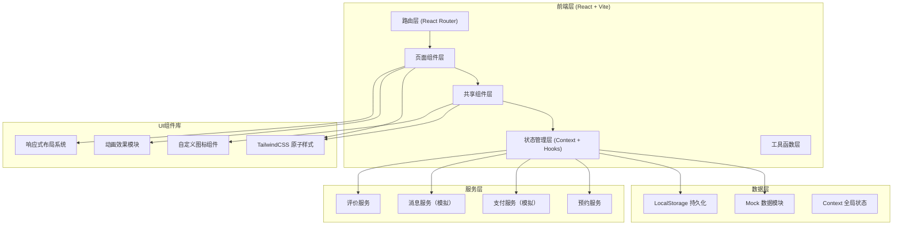
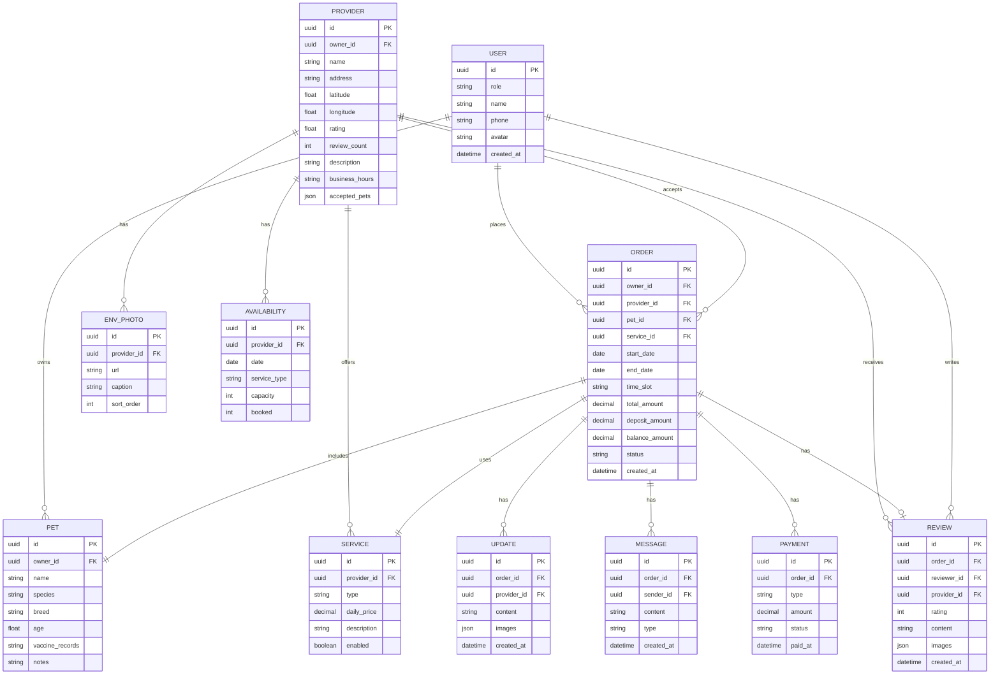

# 宠物寄养预约管理平台 技术架构文档

## 1. 架构设计



---

## 2. 技术栈说明

- **前端框架**：React@18 + TypeScript
- **构建工具**：Vite@5（快速HMR、按需编译）
- **样式方案**：TailwindCSS@3 + PostCSS + Autoprefixer
- **路由管理**：React Router DOM@6
- **状态管理**：React Context + useReducer（全局状态）、React Hooks（局部状态）
- **数据持久化**：LocalStorage（模拟后端）
- **图表库**：Recharts（收入统计图表）
- **图标方案**：Lucide React + 自定义SVG宠物图标
- **动画方案**：Framer Motion（复杂动效）+ CSS Animations（基础过渡）
- **日期处理**：date-fns（日历计算、日期格式化）
- **代码规范**：ESLint + Prettier

---

## 3. 路由定义

| 路由路径 | 页面名称 | 主要模块 | 角色 |
|----------|----------|----------|------|
| `/` | 首页 | Hero搜索、服务分类、优质商家推荐 | 所有用户 |
| `/search` | 搜索结果页 | 筛选条件、商家列表、地图视图 | 宠物主 |
| `/provider/:id` | 商家主页 | 照片画廊、服务项目、日历、评价、预约入口 | 宠物主 |
| `/booking/:providerId` | 预约下单页 | 宠物信息表单、日期选择、价格明细、支付 | 宠物主 |
| `/orders` | 我的订单列表 | 订单卡片、状态筛选、订单入口 | 宠物主 |
| `/orders/:id` | 订单详情页 | 状态追踪、动态时间线、消息窗口、尾款结算、评价 | 宠物主/服务方 |
| `/dashboard` | 服务方后台首页 | 数据概览、今日预约、快捷入口 | 服务方 |
| `/dashboard/calendar` | 预约日历看板 | 周/月视图、颜色状态、预约详情 | 服务方 |
| `/dashboard/pets` | 待接宠物信息 | 宠物列表、疫苗状态、详细信息 | 服务方 |
| `/dashboard/post` | 动态发布 | 图片上传、关联订单、发布管理 | 服务方 |
| `/dashboard/income` | 收入统计 | 趋势图、订单统计、服务费明细 | 服务方 |
| `/dashboard/settings` | 商家设置 | 主页信息、服务配置、宠物类型、照片管理 | 服务方 |
| `/messages` | 消息中心 | 会话列表、聊天窗口 | 宠物主/服务方 |
| `/admin` | 平台审核后台 | 风控列表、投诉管理、审核操作 | 平台管理员 |
| `/login` | 登录/注册页 | 角色切换、表单登录 | 所有用户 |

---

## 4. 核心数据模型

### 4.1 数据实体关系图



### 4.2 Mock数据结构

```typescript
// 全局状态类型
interface AppState {
  currentUser: User | null;
  providers: Provider[];
  orders: Order[];
  reviews: Review[];
  messages: Message[];
  updates: Update[];
}

// 用户类型
type UserRole = 'owner' | 'provider' | 'admin';
interface User {
  id: string;
  role: UserRole;
  name: string;
  phone: string;
  avatar: string;
  providerId?: string;
}

// 宠物类型
interface Pet {
  id: string;
  ownerId: string;
  name: string;
  species: 'dog' | 'cat' | 'other';
  breed: string;
  age: number;
  vaccineRecords: string[];
  notes: string;
}

// 服务类型
type ServiceType = 'daycare' | 'home_visit' | 'boarding';
interface Service {
  id: string;
  providerId: string;
  type: ServiceType;
  dailyPrice: number;
  description: string;
  enabled: boolean;
}

// 服务方（商家）类型
interface Provider {
  id: string;
  ownerId: string;
  name: string;
  address: string;
  latitude: number;
  longitude: number;
  rating: number;
  reviewCount: number;
  description: string;
  businessHours: string;
  acceptedPets: {
    species: string[];
    maxCount: number;
    breedRestrictions?: string[];
  };
  photos: EnvPhoto[];
  services: Service[];
  availability: Availability[];
}

// 订单状态
type OrderStatus = 'pending_confirm' | 'confirmed' | 'in_service' | 'pending_balance' | 'completed' | 'cancelled';
interface Order {
  id: string;
  ownerId: string;
  providerId: string;
  petId: string;
  serviceId: string;
  startDate: string;
  endDate: string;
  timeSlot: string;
  totalAmount: number;
  depositAmount: number;
  balanceAmount: number;
  status: OrderStatus;
  createdAt: string;
}

// 评价
interface Review {
  id: string;
  orderId: string;
  reviewerId: string;
  providerId: string;
  rating: number;
  content: string;
  images: string[];
  createdAt: string;
  response?: string;
}

// 动态更新
interface Update {
  id: string;
  orderId: string;
  providerId: string;
  content: string;
  images: string[];
  createdAt: string;
}

// 消息
interface Message {
  id: string;
  orderId: string;
  senderId: string;
  content: string;
  type: 'text' | 'image';
  createdAt: string;
}
```

---

## 5. 目录结构设计

```
pet-boarding-platform/
├── index.html
├── package.json
├── vite.config.ts
├── tsconfig.json
├── tailwind.config.js
├── postcss.config.js
├── src/
│   ├── main.tsx                 # 应用入口
│   ├── App.tsx                  # 根组件 + 路由
│   ├── index.css                # 全局样式 + Tailwind
│   ├── assets/                  # 静态资源
│   │   ├── images/
│   │   └── icons/
│   ├── data/                    # Mock数据
│   │   ├── users.ts
│   │   ├── providers.ts
│   │   ├── orders.ts
│   │   ├── reviews.ts
│   │   └── index.ts
│   ├── context/                 # 状态管理
│   │   ├── AppContext.tsx
│   │   ├── AuthContext.tsx
│   │   └── types.ts
│   ├── hooks/                   # 自定义Hooks
│   │   ├── useAuth.ts
│   │   ├── useBooking.ts
│   │   ├── useCalendar.ts
│   │   └── useMessages.ts
│   ├── pages/                   # 页面组件
│   │   ├── Home.tsx
│   │   ├── Search.tsx
│   │   ├── ProviderDetail.tsx
│   │   ├── Booking.tsx
│   │   ├── Orders.tsx
│   │   ├── OrderDetail.tsx
│   │   ├── Messages.tsx
│   │   ├── Login.tsx
│   │   ├── dashboard/
│   │   │   ├── Index.tsx
│   │   │   ├── Calendar.tsx
│   │   │   ├── Pets.tsx
│   │   │   ├── PostUpdate.tsx
│   │   │   ├── Income.tsx
│   │   │   └── Settings.tsx
│   │   └── admin/
│   │       └── Review.tsx
│   ├── components/              # 共享组件
│   │   ├── layout/
│   │   │   ├── Header.tsx
│   │   │   ├── Footer.tsx
│   │   │   ├── ProviderSidebar.tsx
│   │   │   └── ProtectedRoute.tsx
│   │   ├── common/
│   │   │   ├── Button.tsx
│   │   │   ├── Card.tsx
│   │   │   ├── Input.tsx
│   │   │   ├── Modal.tsx
│   │   │   ├── StarRating.tsx
│   │   │   └── Avatar.tsx
│   │   ├── provider/
│   │   │   ├── ProviderCard.tsx
│   │   │   ├── ServiceCard.tsx
│   │   │   ├── AvailabilityCalendar.tsx
│   │   │   ├── PhotoGallery.tsx
│   │   │   └── ReviewList.tsx
│   │   ├── booking/
│   │   │   ├── PetForm.tsx
│   │   │   ├── DateTimePicker.tsx
│   │   │   └── PriceBreakdown.tsx
│   │   ├── order/
│   │   │   ├── OrderCard.tsx
│   │   │   ├── OrderTimeline.tsx
│   │   │   ├── UpdateTimeline.tsx
│   │   │   ├── BalancePayment.tsx
│   │   │   └── ReviewForm.tsx
│   │   ├── dashboard/
│   │   │   ├── CalendarBoard.tsx
│   │   │   ├── IncomeChart.tsx
│   │   │   ├── PetCard.tsx
│   │   │   └── StatsCard.tsx
│   │   └── chat/
│   │       ├── ConversationList.tsx
│   │       └── ChatWindow.tsx
│   └── utils/                   # 工具函数
│       ├── date.ts
│       ├── format.ts
│       ├── storage.ts
│       └── mock.ts
```

---

## 6. 核心模块实现策略

### 6.1 空位日历系统
- 基于date-fns生成月度日历矩阵
- 每个日期查询Provider.availability判断容量状态
- 状态颜色编码：绿色(充足)→黄色(紧张)→灰色(已满)
- 日期范围选择联动价格自动计算

### 6.2 预约下单流程
- 分3步向导式表单：宠物信息→日期时段→确认支付
- 每步数据本地缓存，支持回退修改
- 实时价格计算（天数×日单价+服务费）
- 定金=总额30%，尾款自动计算

### 6.3 消息系统
- 基于订单ID创建会话上下文
- 消息按时间排序，滚动自动定位最新
- 模拟消息发送延迟和"对方正在输入"状态
- 未读消息红点计数

### 6.4 收入统计图表
- Recharts渲染AreaChart月度收入趋势
- 按服务类型分组统计饼图
- 可切换时间范围（月/季/年）
- 关键指标卡片：总收入、订单数、平均客单价

### 6.5 风控审核机制
- 自动监测：近30天评分<3星且差评数≥3触发预警
- 审核后台展示商家详情、差评聚合、投诉记录
- 操作选项：警告、限期整改、临时下架、永久封禁
